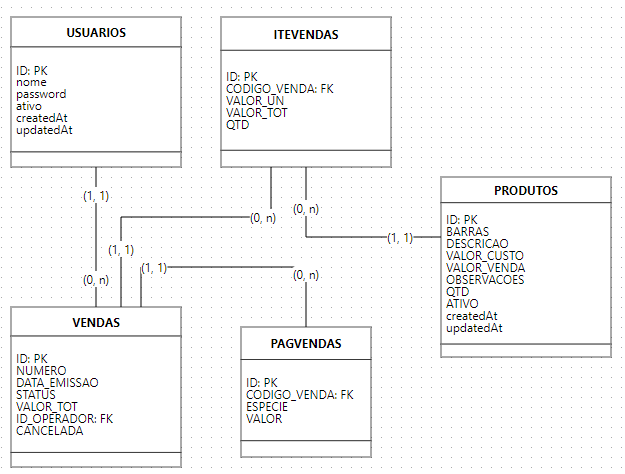

# **Documentação do sistema**

### **Tecnologias utilizadas:**
- **NodeJS v20.10.0**: Para o runtime;
- **ExpressJs v4.19.2**: Parte do servidor, rotas, controllers...;
- **Cookie-Parser v1.4.6**: Para ler os cookies salvos (autenticação);
- **Body-Parser v1.20.2**: Para colher os dados de formulários e requisições;
- **EJS v3.1.9**: Para renderizar dados enviados pelo backend no frontend;
- **Mysql2 v3.9.3**: Para o banco de dados;
- **Sequelize v6.37.2**: Para a manipulação do banco de dados;
- **Sequelize-cli v6.6.2**: Para a criação das tabelas do banco de dados;
- **Serve-Favicon v2.5.0**: Para a definição do Favicon das páginas;
- **Bootstrap v5.0**: Para o Frontend;
- **AJAX e JQUERY**: Para equisições em tempo real e manipulação dos elementos;
- **Path v0.12.7**: Para a localização dos arquivos;
- **Nodemon v3.1.0**: Para o runtime em devmode;

### **Esquema da base de dados:**

Segue abaixo um esquema lógico da base de dados utilizada nesse projeto:

<small>OBS: As cardinalidades entre as tabelas podem não estar corretas pois o aplicativo usado para o desenvolvimento do modelo (BRModeloWeb) não proporciona um meio de alterá-las no modelo lógico</small>

## **Explicando: Árvore de arquivos**

O conteúdo do projeto é separado em pastas e arquivos visando a eficiência e facilidade na manutenção dos componentes.

### **Arquivo Principal**: `./app.js` - Utilizado para iniciar a aplicação

## **Pastas**:

- `config`: contém as configurações do Sequelize, para conexão à base de dados;
- `controllers`: contém todas as classes com métodos utilizados nas rotas, divididas em arquivos separados para cada categoria (Métodos CRUD e Autenticação);
- `migrations`: contém os arquivos utilizados para a criação das tabelas do banco de dados;
- `models`: contém os arquivos dos modelos das tabelas da base de dados, utilizados nos métodos CRUD;
- `node_modules`: contém as dependências da aplicação;
- `routes`: contém as definições das rotas da aplicação, divididas em arquivos separados para cada categoria;
- `seeders`: contém os comandos inicias para povoamento da base de dados com dados de produtos e usuários fictícios
- `src`: Essa pasta contém subpastas:
    - `assets`: imagens e ícones utilizados no projeto;
    - `css`: arquivos de estilo das páginas;
    - `js`: arquivos de javascript executados nas páginas;
    - `views`: páginas utilizadas na aplicação;

## **Conteúdo fora das pastas**:
- `.gitattributes` e `.gitignore`: Arquivos padrão do Github na criação de um repositório;
- `app.js`: Arquivo principal, como mostrado acima;
- `Documentação.md`: **arquivo atual**;
- `image.png`: utilizada para mostrar o esquema da base de dados nesse documento;
- `package-lock.json` e `package.json`: utilizados para definir nome, versão, dependências, scripts... utilizados no projeto
- `povoarbd.sql`: dados fictícios para inserção manual por meio do portal phpMyAdmin;
- `README.md`: apresentação do projeto;